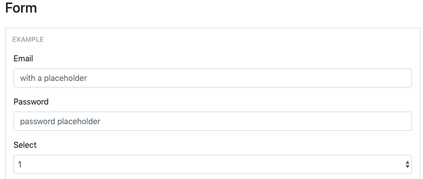

# puppeteer-core-controller

Fluent API around puppeteer-core

[](https://travis-ci.org/hdorgeval/puppeteer-core-controller)
[](https://ci.appveyor.com/project/hdorgeval/puppeteer-core-controller)
[](https://www.npmjs.com/package/puppeteer-core-controller)

- [Usage](#usage)
- [Usage in an existing code base](#Usage-in-an-existing-code-base)
- [Usage with Stories](#Usage-with-Stories)
- [API Documentation](#API-Documentation)

# Usage

```js
import { PuppeteerController } from 'puppeteer-core-controller';

const pptc = new PuppeteerController();
const emailInputSelector = 'input#exampleEmail';
const passwordInputSelector = 'input#examplePassword';
const checkMeOutSelector = 'input[type="checkbox"].form-check-input';
const customSelect = 'select#exampleCustomSelect';
const option = 'Value 3';

await pptc
  .initWith({
    headless: false,
  })
  .withMaxSizeWindow()
  .withCursor()
  .navigateTo('https://reactstrap.github.io/components/form/')
  .hover(emailInputSelector)
  .click(emailInputSelector)
  .typeText('foo.bar@baz.com')
  .pressKey('Tab');
  .expectThat(passwordInputSelector).hasFocus()
  .typeText("don't tell!")
  .pressKey('Tab');
  .expectThat(passwordInputSelector).hasClass('is-valid')
  .hover(checkMeOutSelector)
  .click(checkMeOutSelector)
  .select(option).in(customSelect)
  .close();
```

# Usage in an existing code base

```js
import { PuppeteerController } from 'puppeteer-core-controller';

// existing code that has a browser and page instance
// ...

const pptc = new PuppeteerController(browser, page);
const emailInputSelector = 'input#exampleEmail';
const passwordInputSelector = 'input#examplePassword';
const checkMeOutSelector = 'input[type="checkbox"].form-check-input';
const customSelect = 'select#exampleCustomSelect';
const option = 'Value 3';

await pptc
  .navigateTo('https://reactstrap.github.io/components/form/')
  .click(emailInputSelector)
  .typeText('foo.bar@baz.com')
  .pressKey('Tab');
  .expectThat(passwordInputSelector).hasFocus()
  .typeText("don't tell!")
  .pressKey('Tab');
  .expectThat(passwordInputSelector).hasClass('is-valid')
  .click(checkMeOutSelector)
  .select(option).in(customSelect)
  .close();
```

# Usage with Stories

```js
import { PuppeteerController, Story, StoryWithProps } from 'puppeteer-core-controller';

const pptc = new PuppeteerController();
const launchOptions: LaunchOptions = {
  headless: true,
};
const url = 'https://reactstrap.github.io/components/form';
const customSelect = 'select#exampleCustomSelect';
const option = 'Value 3';

interface StartOptions {
  launchOptions: LaunchOptions;
  url: string;
}

const openApplication: StoryWithProps<StartOptions> = async (pptc, props) => {
  await pptc
    .initWith(props.launchOptions)
    .withMaxSizeWindow()
    .withCursor()
    .navigateTo(props.url);
};

const fillForm: Story = async (pptc) => {
  await pptc
    .click(customSelect)
    .select(option)
    .in(customSelect);
};

const params: StartOptions = { launchOptions, url };
await pptc
  .runStory(openApplication, params)
  .runStory(fillForm)
  .close();
```

# API Documentation

- Chainable Methods

  - [initWith([options])](#initWithoptions)
  - [withMaxSizeWindow([minViewPort])](#withMaxSizeWindowminViewPort)
  - [withCursor()](#withCursor)
  - [navigateTo(url)](#navigateTourl)
  - [hover(selector[, options])](#hoverselector-options)
  - [clear(selector[, options])](#clearselector-options)
  - [click(selector[, options])](#clickselector-options)
  - [typeText(text[, options])](#typeTexttext-options)
  - [pressKey(key[, options])](#pressKeykey-options)
  - [select(values).in(selector[, options])](#selectvaluesinselector-options)
  - [find(selector[, waitOptions]).withText(text).click([clickOptions])](#findselector-waitOptionswithTexttextclickclickOptions)
  - [find(selector[, waitOptions]).withExactText(text).click([clickOptions])](#findselector-waitOptionswithExactTexttextclickclickOptions)
  - [runStory(story)](#runStorystory)

- Chainable Assertions

  - [expecThat(selector).hasClass(className,[options])](#expecThatSelectorhasClassclassNameoptions)
  - [expecThat(selector).hasExactValue(value,[options])](#expecthatselectorhasexactvaluevalueoptions)
  - [expecThat(selector).hasFocus([options])](#expecThatselectorhasFocusoptions)
  - [expecThat(selector).isDisabled([options])](#expecThatselectorisDisabledoptions)
  - [expecThat(selector).isEnabled([options])](#expecThatselectorisEnabledoptions)
  - [expecThat(selector).isVisible([options])](#expecThatselectorisVisibleoptions)
  - [expecThat(selector).isNotVisible([options])](#expecThatselectorisNotVisibleoptions)

- Helper Methods

  - [cast(any)](#castany)
  - [getClientRectangleOf(selector)](#getClientRectangleOfselector)
  - [getComputedStyleOf(selector)](#getComputedStyleOfselector)
  - [getCurrentUrl()](#getCurrentUrl)
  - [getInstances()](#getInstances)
  - [getSelectedOptionOf(selector)](#getSelectedOptionOfselector)
  - [getValueOf(selector)](#getValueOfselector)
  - [isChecked(selector)](#isCheckedselector)
  - [isDisabled(selector)](#isDisabledselector)
  - [isVisible(selector)](#isVisibleselector)
  - [isNotVisible(selector)](#isNotVisibleselector)
  - [takeFullPageScreenshotAsBase64([options])](#takeFullPageScreenshotAsBase64options)

## Chainable Methods

### initWith([options])

- options: same object as [puppeteer.launch([options])](https://github.com/puppeteer/puppeteer/blob/v2.0.0/docs/api.md#puppeteerlaunchoptions)

---

### withMaxSizeWindow([minViewPort])

- maximize the window size. Should be called after `initWith` and before all other actions.

- minViewPort: {minWidth: number, minHeight: number }
  This method might not work on CI environment. In this case setup the minViewPort parameter to ensure the page has a minimum width and height.

---

### withCursor()

- show a cursor that is bound to the current mouse position. This method should be called before navigateTo(url).



---

### navigateTo(url)

- navigate to the specified url

---

### click(selector[, options])

- selector: string
- options: same object as [page.click(selector[, options])](https://github.com/puppeteer/puppeteer/blob/v2.0.0/docs/api.md#pageclickselector-options)

  with an additional property: `timeoutInMilliseconds`. This option enables the click method to wait for the selector to appear in the DOM before attempting to click on it. Defaults to 30000 (30 seconds). Pass 0 to disable this timeout.

---

### hover(selector[, options])

- selector: string
- options: {steps: number, timeoutInMilliseconds: number }

  `timeoutInMilliseconds` option enables the hover method to wait for the selector to appear in the DOM before attempting to move the mouse on it. Defaults to 30000 (30 seconds). Pass 0 to disable this timeout.

---

### typeText(text[, options])

- text: string
- options: same object as [keyboard.type(text[, options])](https://github.com/puppeteer/puppeteer/blob/v2.0.0/docs/api.md#keyboardtypetext-options)

  except that `delay` defaults to 50 milliseconds. Set the `delay` value to `0` to disable the delay.

---

### clear(selector[, options])

Clear text in an input box.

- selector: string
- options: same object as [page.click(selector[, options])](https://github.com/puppeteer/puppeteer/blob/v2.0.0/docs/api.md#pageclickselector-options)

This method does not wait for the selector to be in the DOM.
In some cases you might have to wait that the input field is visible before clearing it's value:

```js
const value = await pptc
  .expectThat(selector)
  .isVisible()
  .hover(selector)
  .clear(selector);
```

---

### pressKey(key[, options])

- key: 'Tab' | 'Backspace' | 'Enter'
- options: same object as [keyboard.press(key[, options])](https://github.com/puppeteer/puppeteer/blob/v2.0.0/docs/api.md#keyboardpresskey-options)

  except that `delay` defaults to 50 milliseconds. Set the `delay` value to `0` to disable the delay.

---

### select(values).in(selector[, options])

- values and selector: same as [page.select(selector, ...values)](https://github.com/puppeteer/puppeteer/blob/v2.0.0/docs/api.md#pageselectselector-values)
- options: {timeoutInMilliseconds}. This option enables the select method to wait for the selector to appear in the DOM before attempting to select the option(s). Defaults to 30000 (30 seconds). Pass 0 to disable this timeout.

---

### find(selector[, waitOptions]).withText(text).click([clickOptions])

find a selector whose innerText property contains `text`, then click on it.

```js
await pptc
  .initWith({ headless: true })
  .withCursor()
  .navigateTo('https://reactstrap.github.io')
  .find('a.btn')
  .withText('Components')
  .click();
```

- selector: string
- waitOptions: {timeoutInMilliseconds: number}.
  The find method will wait for the selector to to be visible until `timeoutInMilliseconds` expires. Defaults to 30000 (30 seconds).
- withText(text)
- clickOptions: same object as [page.click(selector[, options])](https://github.com/puppeteer/puppeteer/blob/v2.0.0/docs/api.md#pageclickselector-options)

---

### find(selector[, waitOptions]).withExactText(text).click([clickOptions])

find a selector whose innerText property is exactly equal to `text`, then click on it.

```js
await pptc
  .initWith({ headless: true })
  .withCursor()
  .navigateTo('https://reactstrap.github.io')
  .find('a.btn')
  .withExactText('Components')
  .click();
```

- selector: string
- waitOptions: {timeoutInMilliseconds: number}.
  The find method will wait for the selector to to be visible until `timeoutInMilliseconds` expires. Defaults to 30000 (30 seconds).
- withExactText(text)
- clickOptions: same object as [page.click(selector[, options])](https://github.com/puppeteer/puppeteer/blob/v2.0.0/docs/api.md#pageclickselector-options)

---

## Assertion API

### expecThat(selector).hasFocus([options])

- selector: string
- options: {timeoutInMilliseconds}. This option enables the assertion mechanism to wait for the selector to have the focus. Defaults to 30000 (30 seconds).

---

### expecThat(selector).hasClass(className,[options])

- selector: string
- className: string
- options: {timeoutInMilliseconds}. This option enables the assertion mechanism to wait for the selector to have the specified class. Defaults to 30000 (30 seconds).

---

### expecThat(selector).hasExactValue(value,[options])

- selector: string
- value: string
- options: {timeoutInMilliseconds}. This option enables the assertion mechanism to wait for the selector to have the specified value. Defaults to 30000 (30 seconds).

```js
await pptc
  .click(emailInputSelector)
  .typeText('foo.bar@baz.com')
  .expectThat(emailInputSelector)
  .hasExactValue('foo.bar@baz.com');
```

---

### expecThat(selector).isDisabled([options])

- selector: string
- options: {timeoutInMilliseconds}. This option enables the assertion mechanism to wait for the selector to be disabled. Defaults to 30000 (30 seconds).

---

### expecThat(selector).isEnabled([options])

- selector: string
- options: {timeoutInMilliseconds}. This option enables the assertion mechanism to wait for the selector to be enabled. Defaults to 30000 (30 seconds).

---

### expecThat(selector).isVisible([options])

- selector: string
- options: {timeoutInMilliseconds}. This option enables the assertion mechanism to wait for the selector to be visible. Defaults to 30000 (30 seconds).

---

### expecThat(selector).isNotVisible([options])

- selector: string
- options: {timeoutInMilliseconds}. This option enables the assertion mechanism to wait for the selector to be hidden or to disappear from the DOM. Defaults to 30000 (30 seconds).

---

## Helper Methods

### getComputedStyleOf(selector)

- selector: string
- returns: `Promise<CSSStyleDeclaration>`

  ```js
  const validInput = 'input[type="text"].is-valid.form-control';
  const computedStyles = await pptc.getComputedStyleOf(validInput);
  expect(computedStyles.borderColor).toBe('rgb(40, 167, 69)');
  ```

---

### getClientRectangleOf(selector)

- selector: string

  ```js
  const selector = 'input[type="text"].is-valid.form-control';
  const selectorClientRectangle = await pptc.getClientRectangleOf(selector);

  const middleX = selectorClientRectangle.left + selectorClientRectangle.width / 2;
  const middleY = selectorClientRectangle.top + selectorClientRectangle.height / 2;

  const expectedMiddleX = 100;
  const expectedMiddleY = 100;

  expect(Math.abs(middleX - expectedMiddleX)).toBeLessThanOrEqual(1);
  expect(Math.abs(middleY - expectedMiddleY)).toBeLessThanOrEqual(1);
  ```

---

### getCurrentUrl()

- returns: `Promise<string>`

---

### isChecked(selector)

- selector: string
- returns: `Promise<boolean>`

---

### isDisabled(selector)

- selector: string
- returns: `Promise<boolean>`

---

### isVisible(selector)

- selector: string
- returns: `Promise<boolean>`

---

### isNotVisible(selector)

- selector: string
- returns: `Promise<boolean>`

---

### getSelectedOptionOf(selector)

- selector: string
- returns: `Promise<string>`

---

### getValueOf(selector)

- selector: string
- returns: `Promise<string>`

This method does not wait for the selector to be in the DOM.
In some cases you might have to wait that the input field is visible before getting it's value:

```js
const value = await pptc
  .expectThat(selector)
  .isVisible()
  .getValueOf(selector);
```

---

### takeFullPageScreenshotAsBase64([options])

- options: same object as [page.screenshot([options])](https://github.com/puppeteer/puppeteer/blob/v2.0.0/docs/api.md#pagescreenshotoptions)

  ```js
  const screenshot = await pptc.takeFullPageScreenshotAsBase64();
  ```

---

### runStory(story)

- story: Story | StoryWithProps

---

### getInstances()

- get browser and page instances of the controller in order to do stuff not covered by this API.

  ```js
  const pptc = new PuppeteerController();

  // use the pptc controller API
  // ...

  const [browser, page] = pptc.getIntances();
  // now use the browser and page instances through the puppeteer API
  ```

---

### cast(any)

- cast input object as a PuppeteerController instance; usefull when a PuppeteerController instance is stored in an untyped context like in cucumberJS.

```js
const pptc = cast(this.context.pptc);
// use the pptc controller API
// ...
```

---
